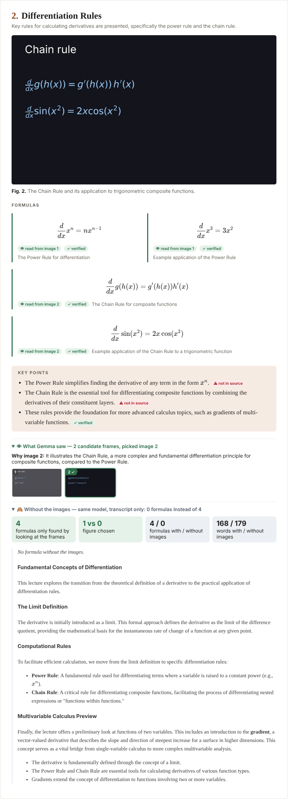

# Lecturify

**Paste a YouTube lecture, get an illustrated course handout. Gemma 4 *watches* the video's frames, picks the best figure for each section and reads the formulas off the screen into LaTeX.**



Built in one day at **Hacktoberfest Hack Day 2026 — UQAM × MLH**, for *Best Use of Gemma 4* and *Best Open-Source AI Project*.

---

## What it does

Educational videos (3Blue1Brown, lectures, tutorials) are great to watch but hard to *review*. Lecturify turns a video into
notes that look like a university handout:

- the lecture is split into **sections** that follow its teaching progression, each with a clickable timestamp;
- each section has **the best figure from the video**, chosen by Gemma 4 among several candidate frames;
- **formulas visible on screen are transcribed into LaTeX** and rendered with KaTeX, each with a source badge:
  `👁 read from image 3` or `🗒 from transcript`;
- concise notes (Markdown + math) and key takeaways;
- a **“What Gemma saw”** panel under every section: all candidate frames, the one Gemma picked, and why;
- one self-contained `output.html`: normal reading, **slides mode** (← / →, Esc) and **print / PDF** (one section per page).

## How it works

```
YouTube URL
  ├─► yt-dlp ─► video.mp4 ─► frame sampler ─► stable, deduplicated frames ─► frames.json + frames/
  └─► subtitles (youtube-transcript-api | yt-dlp) ─► transcript.json
                          │
      Pass 1 — Gemma 4, text: whole timestamped transcript ─► outline.json (course + 4–10 sections)
                          │
      Pass 2 — Gemma 4, MULTIMODAL, one call per section: ≤ 6 frames + section transcript ─► notes.json
                          │
      Jinja2 + KaTeX ─► output.html (self-contained, images inlined)
```

**Gemma's role at each step**

| Step | Input to Gemma | What Gemma does |
|---|---|---|
| Pass 1 — structure | The full transcript with `[mm:ss]` stamps (fits easily in the 256K context) | Splits the lecture into coherent sections, writes the course title, summary and prerequisites |
| Pass 2 — notes | Up to 6 labeled frames (`Image 3 — t=04:12`) + the section's transcript | **Looks at the frames**: picks the most informative figure and explains why, **transcribes every formula/matrix shown on screen into LaTeX**, writes handout-style notes and key points |

No audio is ever sent to Gemma. The transcript comes from YouTube subtitles.

**The frame sampler** (`lecturify/ingest/frames.py`) is the visual core. 3Blue1Brown-style videos animate continuously on
dark backgrounds, so scene-cut detection fails. We sample one frame per second and keep the frames where motion has stopped,
i.e. the *end* of each animation, when the drawing is complete. Then we:
- reject empty frames (Canny edge density, not brightness, because backgrounds are dark);
- group look-alike frames with perceptual hashes and keep the last of each group;
- deduplicate across the whole video;
- drop half-drawn frames whose edges are contained in a later, more complete frame.

On an 8-min video this leaves ~27 frames. `python -m lecturify frames-debug <id>` writes a contact sheet to check them.

**Robustness** (the demo must not crash):
- every step is cached on disk (`data/<video_id>/`), including every Gemma response. A rerun is free and works offline;
- retries with exponential backoff on 429/5xx and network errors;
- a JSON repair pass, plus a two-layer fix for the classic **LaTeX-in-JSON trap**: `"\frac"` is *valid* JSON for
  form-feed + `rac`, and `"\theta"` for tab + `heta`. Both are repaired before and after parsing, with unit tests.

## Why Gemma 4

- **Multimodal understanding**: Gemma reads diagrams, matrices and formulas directly from video frames and chooses which
  frame best explains a concept. Without the images you only get a transcript summary; with them you get a handout.
- **Long context**: a whole lecture transcript fits in one request, so the section split sees the full teaching arc.
- **Open weights**: the same model can be self-hosted later. Here we use it through the Gemini API to prototype fast.

## Models & licenses

- **Model:** `gemma-4-26b-a4b-it` (default, MoE, fast) or `gemma-4-31b-it`, via the
  [Gemini API](https://ai.google.dev/gemma/docs/core/gemma_on_gemini_api).
- **Gemma 4 license:** Apache 2.0 — <https://ai.google.dev/gemma/apache_2>.
- **This project:** [MIT](LICENSE).
- **Main dependencies:** [google-genai](https://github.com/googleapis/python-genai) (Apache-2.0),
  [yt-dlp](https://github.com/yt-dlp/yt-dlp) (Unlicense),
  [youtube-transcript-api](https://github.com/jdepoix/youtube-transcript-api) (MIT),
  [OpenCV](https://opencv.org/license/) (Apache-2.0), [imageio-ffmpeg](https://github.com/imageio/imageio-ffmpeg)
  (BSD-2; bundles FFmpeg, LGPL/GPL), [ImageHash](https://github.com/JohannesBuchner/imagehash) (BSD-2),
  [NumPy](https://numpy.org/) (BSD-3), [Pillow](https://python-pillow.org/) (MIT-CMU),
  [pydantic](https://github.com/pydantic/pydantic) (MIT), [Jinja2](https://jinja.palletsprojects.com/) (BSD-3),
  [markdown-it-py](https://github.com/executablebooks/markdown-it-py) (MIT), [Flask](https://flask.palletsprojects.com/) (BSD-3),
  [KaTeX](https://katex.org/) (MIT).

## Quickstart

Requirements: Python 3.11+, a [Gemini API key](https://aistudio.google.com/apikey). ffmpeg is optional: a static build
ships with `imageio-ffmpeg`.

```bash
git clone https://github.com/Matteodt974/hacktoberfest_project && cd hacktoberfest_project
python3 -m venv .venv && source .venv/bin/activate
pip install -r requirements.txt
cp .env.example .env            # then put your key: GEMINI_API_KEY=...
python -m lecturify smoke-test  # checks text, image, JSON and multi-image calls to Gemma 4
python -m lecturify run "https://www.youtube.com/watch?v=LPZh9BOjkQs"
open data/LPZh9BOjkQs/output.html
```

## CLI usage

```
python -m lecturify smoke-test
python -m lecturify run <youtube_url|video_id> [--lang en|fr] [--model gemma-4-26b-a4b-it|gemma-4-31b-it] [--max-images 6] [--force]
python -m lecturify render <video_id>          # re-render output.html offline from the cache
python -m lecturify ingest <youtube_url>       # metadata + subtitles + video only
python -m lecturify frames-debug <video_id>    # extract frames + HTML contact sheet
python -m lecturify bundle <video_id>          # zip the cache (without the video) to move it between machines
python -m lecturify import-local <id> <video.mp4> <subs.vtt>   # no YouTube access needed
```

Tests (offline, no network): `python -m pytest`.

## Limitations & responsible use

- The video needs **subtitles** (manual or automatic). Videos over 45 min are refused (20 min+ triggers a warning).
- YouTube often blocks downloads from cloud/datacenter IPs: run Lecturify on your own machine.
- Extracted frames belong to the video's creator. Generated notes are for **personal study**; don't redistribute them.
- Gemma can misread a formula. Every formula shows its source (image or transcript), and the candidate frames are visible
  in "What Gemma saw" so you can check.

## Built at

Hacktoberfest Hack Day 2026 — UQAM × MLH (Montréal), for **Best Use of Gemma 4** and **Best Open-Source AI Project**.
Development log with every decision and pitfall: [DEVLOG.md](DEVLOG.md).

## License

[MIT](LICENSE) © 2026 Mattéo Destriez--Terrighi
